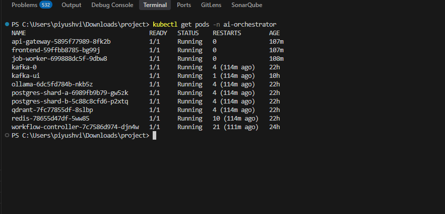
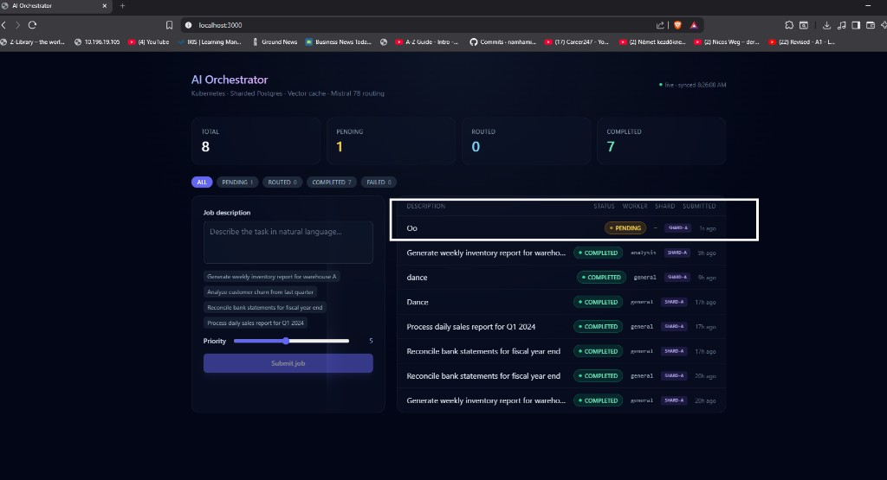
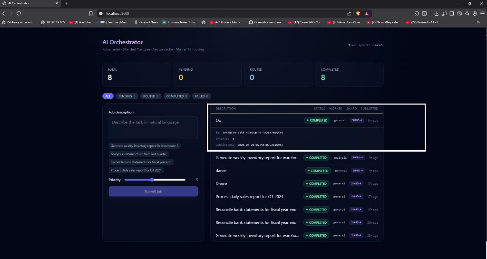
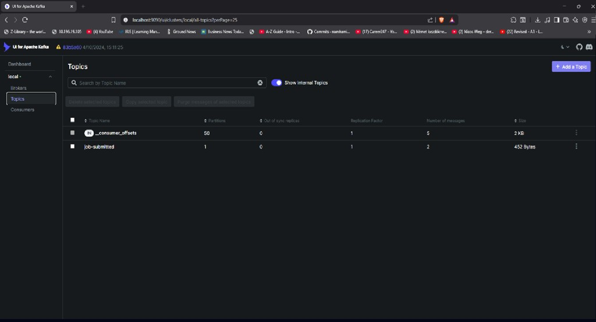
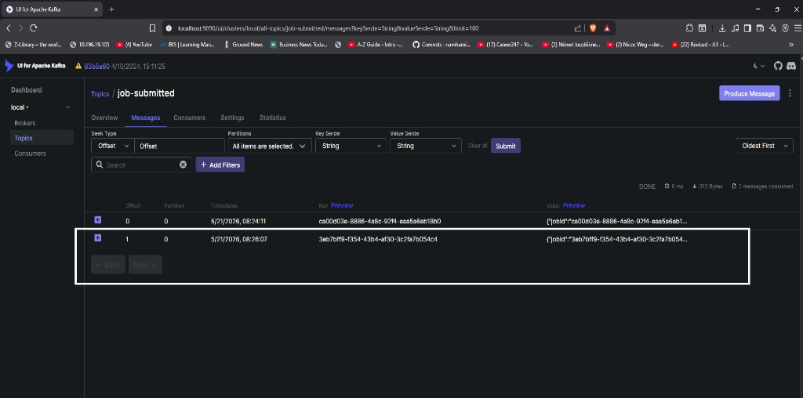
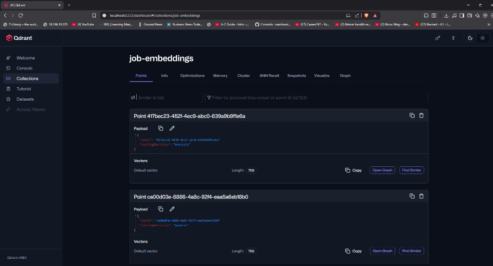
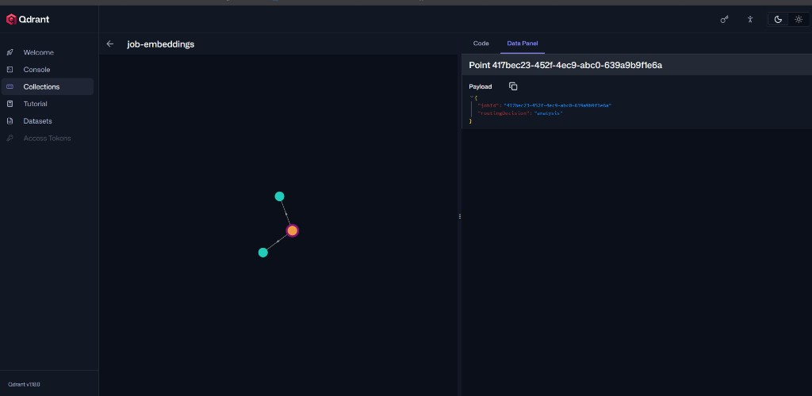
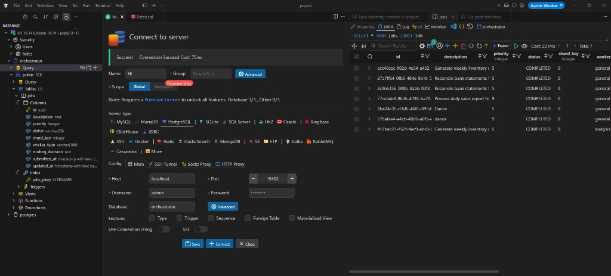
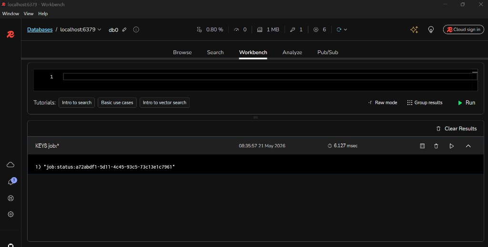

# Intelligent Workflow Orchestrator

> **AI-powered job routing on Kubernetes** — A production-style distributed system that accepts natural-language job descriptions, generates vector embeddings via Ollama (`nomic-embed-text`), performs semantic similarity search against a Qdrant vector store, and falls back to a Mistral 7B LLM for routing decisions when no cached result exists. Built entirely on Minikube with real microservices, sharded PostgreSQL, Redis cache-aside, and Kafka async pipeline.

[](https://openjdk.org/projects/jdk/21/)
[](https://spring.io/projects/spring-boot)
[](https://minikube.sigs.k8s.io/)
[](https://kafka.apache.org/)
[](https://qdrant.tech/)
[](https://ollama.com/)

---

## Table of Contents

- [Architecture Overview](#architecture-overview)
- [Live Screenshots](#live-screenshots)
  - [Kubernetes Cluster](#kubernetes-cluster)
  - [Frontend Dashboard](#frontend-dashboard)
  - [Kafka Event Pipeline](#kafka-event-pipeline)
  - [Qdrant Vector Store](#qdrant-vector-store)
  - [PostgreSQL Shards](#postgresql-shards)
  - [Redis Cache](#redis-cache)
- [Key Features](#key-features)
- [Tech Stack](#tech-stack)
- [Project Structure](#project-structure)
- [How It Works](#how-it-works)
- [Running Locally](#running-locally)
- [Diagrams](#diagrams)

---

## Architecture Overview

```
Browser → Nginx (Frontend) → Spring Cloud Gateway → Workflow Controller
                                                           │
                                                    PostgreSQL (Shard A/B)
                                                    Redis (cache-aside)
                                                    Kafka (job-submitted)
                                                           │
                                                      Job Worker
                                                           │
                                              ┌────────────┴────────────┐
                                      Ollama (embed)            Qdrant (vector search)
                                              │                         │
                                      Ollama (Mistral 7B)       Cache HIT → skip LLM
                                        LLM routing fallback
```

---

## Live Screenshots

### Kubernetes Cluster

All 11 pods running healthy in the `ai-orchestrator` namespace on Minikube:



---

### Frontend Dashboard

**Job submitted — PENDING state** (Kafka event published, job-worker processing):



**All jobs COMPLETED** — shows status filter bar, shard assignment, worker type, and expandable details:



---

### Kafka Event Pipeline

**`job-submitted` topic** — 1 partition, 2 messages consumed, 452 bytes:



**Messages in topic** — job UUID as key, full payload as value, consumed by `job-worker`:



---

### Qdrant Vector Store

**`job-embeddings` collection** — each point stores a 768-dim embedding and `routingDecision` payload. The second job ("general") was routed by Mistral 7B; the first ("analysis") was a Qdrant cache hit:



**Embedding graph** — 2D projection of semantic similarity between stored job vectors:



---

### PostgreSQL Shards

Jobs table on Shard A — `id`, `description`, `priority`, `status`, `shard_key`, `worker_type`, `routing_decision`, timestamps. All 7 entries marked `COMPLETED`:



---

### Redis Cache

Job status cached in Redis by key `job:status:{uuid}` — feeds the cache-aside read path for instant status lookups without hitting the database:



---

## Key Features

| Feature | Detail |
|---|---|
| **AI Routing** | Mistral 7B LLM classifies job type (`analysis`, `general`, etc.) |
| **Vector Cache** | Qdrant cosine similarity search — skips LLM on cache hit (35× faster) |
| **Async Pipeline** | Kafka KRaft — job events decoupled from HTTP request lifecycle |
| **Sharded DB** | PostgreSQL × 2 shards via `AbstractRoutingDataSource` + hash(UUID) mod 2 |
| **Redis Cache-aside** | Job status served from Redis on repeat reads |
| **Virtual Threads** | Java 21 virtual threads for non-blocking Kafka consumer concurrency |
| **Multi-stage Docker** | Hardened images — non-root user, health checks, minimal layers |
| **Spring Cloud Gateway** | Centralised CORS, routing, and future rate-limiting entrypoint |

---

## Tech Stack

| Layer | Technology |
|---|---|
| Language | Java 21 (Virtual Threads) |
| Framework | Spring Boot 3, Spring Cloud Gateway |
| Messaging | Apache Kafka (KRaft, no Zookeeper) |
| Databases | PostgreSQL (×2 shards), Redis |
| Vector DB | Qdrant |
| AI / LLM | Ollama — `nomic-embed-text` (embeddings), `mistral:7b` (routing) |
| Frontend | React 18, TypeScript, Vite, Tailwind CSS, Nginx |
| Container | Docker (multi-stage), Minikube |
| Orchestration | Kubernetes — Deployments, ConfigMaps, Services, PVCs |
| Build | Maven (multi-module BOM) |

---

## Project Structure

```
local-ai-orchestrator/
├── orchestrator-parent/          # Maven multi-module root
│   ├── api-gateway/              # Spring Cloud Gateway (port 8080)
│   ├── workflow-controller/      # Job API + Kafka publisher (port 8081)
│   └── job-worker/               # Kafka consumer + AI pipeline (port 8082)
├── frontend/                     # React + Vite + Nginx
├── k8s/
│   ├── infra/                    # PostgreSQL, Redis, Kafka, Qdrant, Ollama
│   └── app/                      # api-gateway, workflow-controller, job-worker, frontend
├── scripts/
│   ├── deploy-infra.ps1          # Full infra deployment + Ollama model setup
│   ├── deploy-apps.ps1           # App build → image load → rollout + port-forward
│   ├── safe-shutdown.ps1         # Graceful cluster teardown
│   └── smoke-test.ps1            # End-to-end job submission test
└── docs/
    ├── PROJECT.md                # Full project spec
    ├── DIAGRAMS.md               # All Mermaid diagrams (combined)
    ├── WORK_PROOF_LOGS.md        # Execution logs from all services
    ├── diagrams/                 # Individual diagram .md + rendered .png files
    └── screenshots/              # Live system screenshots
```

---

## How It Works

### Cache MISS path (first submission of a new job type)
1. **POST** `/api/v1/jobs` → API Gateway → Workflow Controller  
2. Job persisted to PostgreSQL (shard by `hash(UUID) mod 2`), status = `PENDING`  
3. Kafka event `job-submitted` published  
4. Job Worker consumes event → calls Ollama `nomic-embed-text` → 768-dim float vector  
5. Qdrant similarity search returns no match (score < 0.9)  
6. Ollama Mistral 7B classifies job → `{workerType, reasoning, priority}`  
7. Embedding + routing decision upserted to Qdrant  
8. Workflow Controller PATCH'd → `ROUTED` → `COMPLETED`

### Cache HIT path (semantically similar job seen before)
1–4. Same as above  
5. Qdrant returns match with score ≥ 0.9 → routing decision reused  
6. **Mistral 7B skipped entirely** (~60–90 s saved)  
7. Job completes in ~2–7 s end-to-end

---

## Running Locally

> Requires: Docker Desktop, Minikube, kubectl, PowerShell, Ollama (Windows host)

```powershell
# 1. Pull AI models on Windows host (required before cluster start)
ollama pull mistral:7b
ollama pull nomic-embed-text

# 2. Start Minikube
minikube start --driver=docker --cpus=6 --memory=10240

# 3. Deploy infrastructure (PostgreSQL, Redis, Kafka, Qdrant, Ollama)
.\scripts\deploy-infra.ps1

# 4. Build and deploy application services + open frontend
.\scripts\deploy-apps.ps1

# 5. Open http://localhost:3000
```

---

## Diagrams

All diagrams are available individually in [`docs/diagrams/`](docs/diagrams/) as both Mermaid source and rendered PNG:

| # | Diagram | File |
|---|---|---|
| 1 | System Architecture | [diagram-01](docs/diagrams/diagram-01-system-architecture.md) |
| 2 | Sequence — Cache MISS | [diagram-02](docs/diagrams/diagram-02-sequence-cache-miss.md) |
| 3 | Sequence — Cache HIT | [diagram-03](docs/diagrams/diagram-03-sequence-cache-hit.md) |
| 4 | Component Diagram | [diagram-04](docs/diagrams/diagram-04-component.md) |
| 5 | State Machine | [diagram-05](docs/diagrams/diagram-05-state-machine.md) |
| 6 | ER Diagram | [diagram-06](docs/diagrams/diagram-06-er-diagram.md) |
| 7 | Class Diagram | [diagram-07](docs/diagrams/diagram-07-class-diagram.md) |
| 8 | Deployment Diagram | [diagram-08](docs/diagrams/diagram-08-deployment.md) |
| 9 | Data Flow | [diagram-09](docs/diagrams/diagram-09-data-flow.md) |
| 10 | AI Routing Pipeline | [diagram-10](docs/diagrams/diagram-10-ai-routing-pipeline.md) |
| 11 | Sharding Logic | [diagram-11](docs/diagrams/diagram-11-sharding-logic.md) |
