# Intelligent Workflow Orchestrator — Architecture & UML Diagrams

---

## 1. System Architecture Diagram

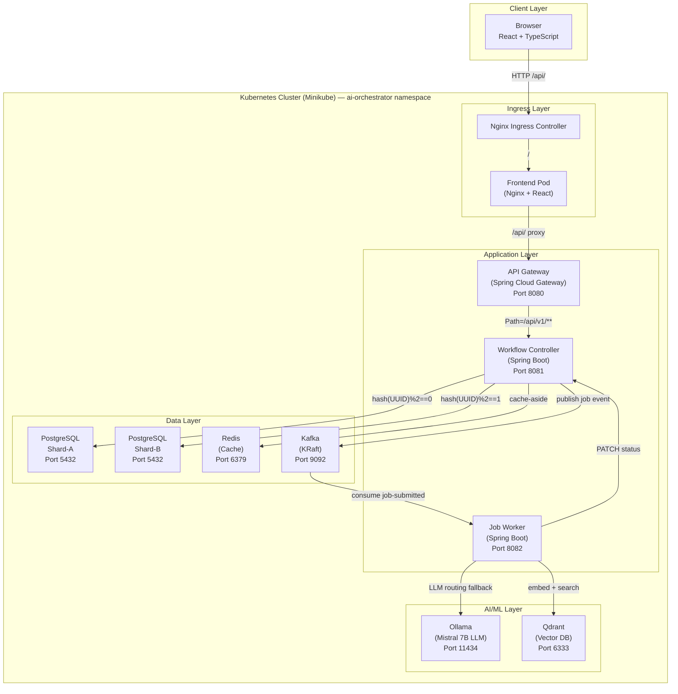

---

## 2. Job Submission Sequence Diagram (Cache MISS — LLM Path)

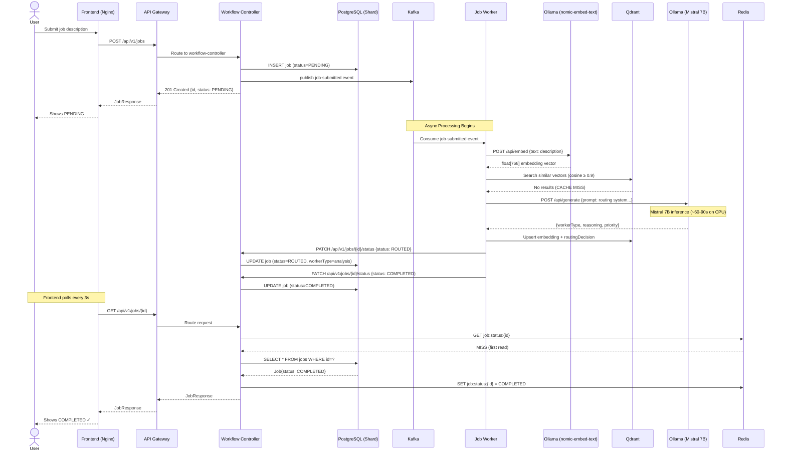

---

## 3. Job Submission Sequence Diagram (Cache HIT — Qdrant Fast Path)

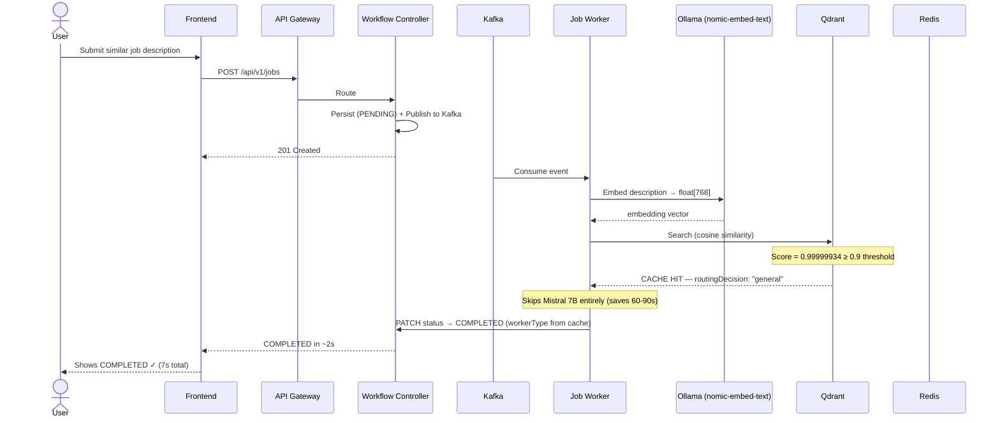

---

## 4. Component Diagram

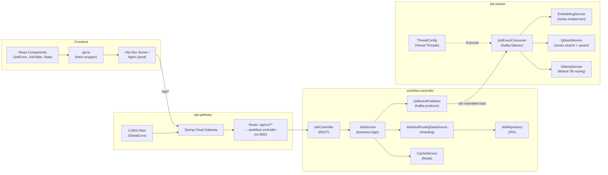

---

## 5. State Machine — Job Lifecycle

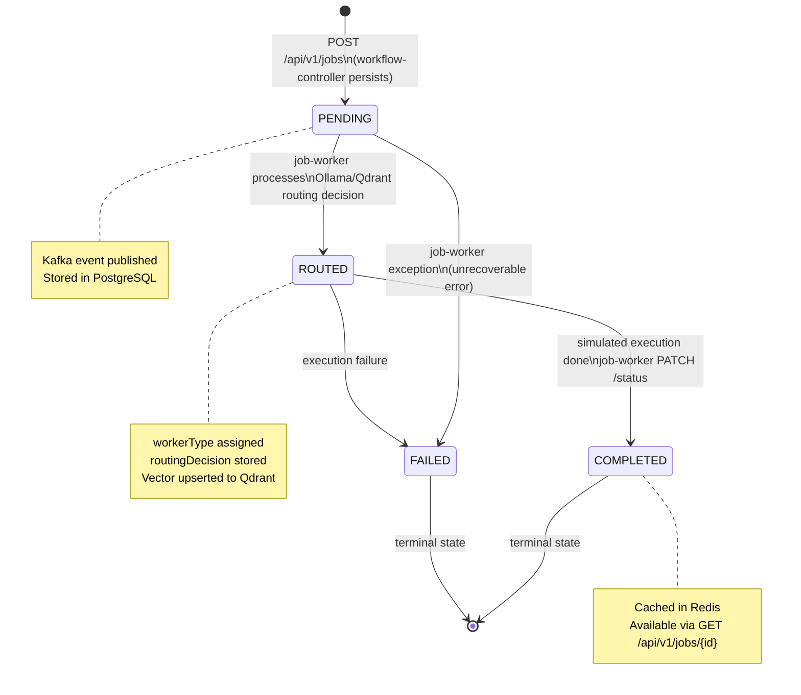

---

## 6. Entity Relationship Diagram (PostgreSQL Schema)

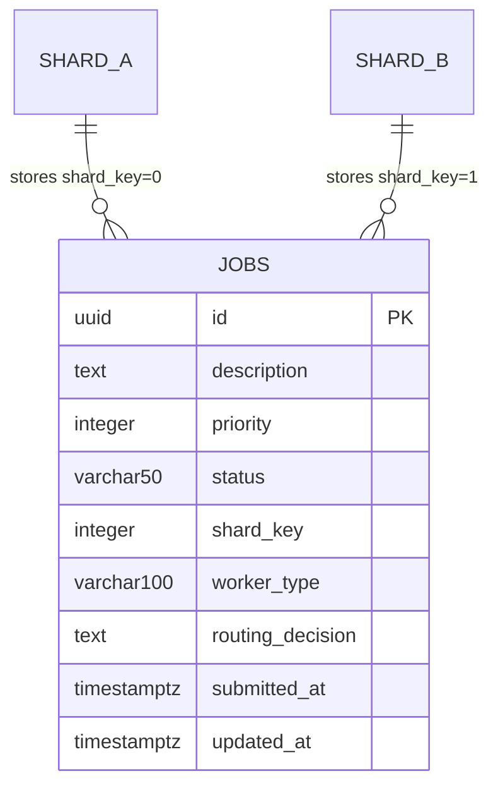

---

## 7. Class Diagram — Domain Model

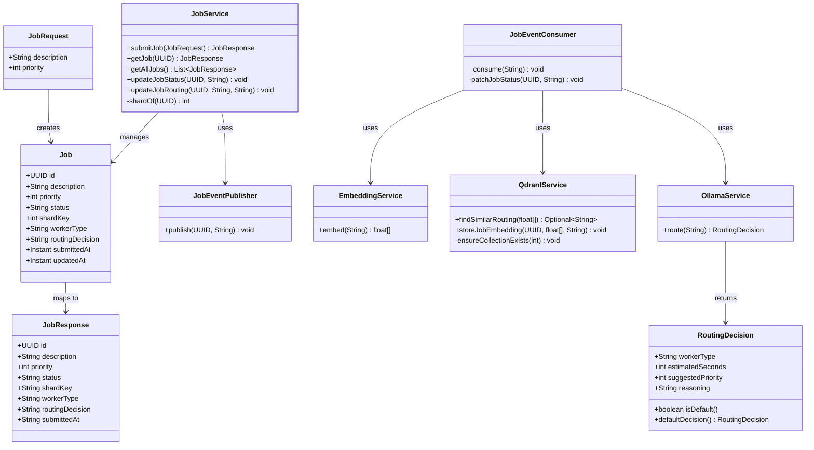

---

## 8. Deployment Diagram (Kubernetes)

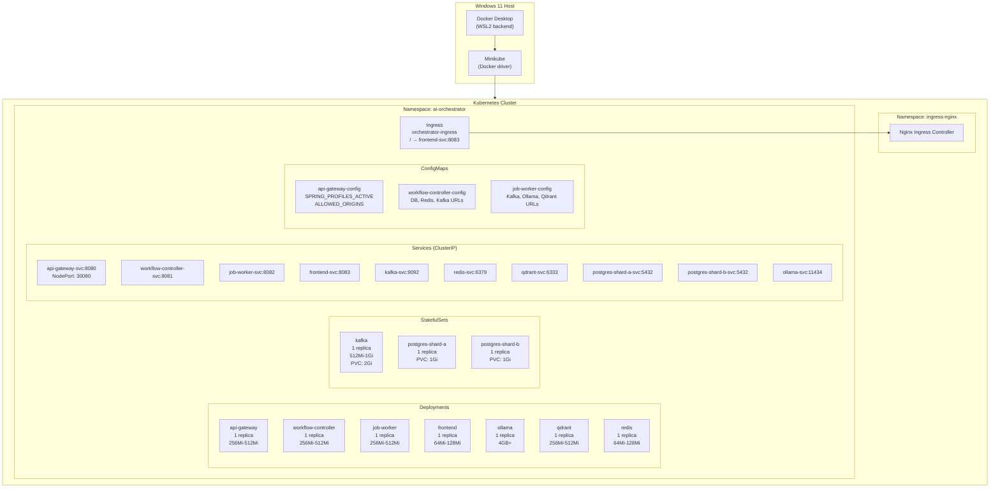

---

## 9. Data Flow Diagram

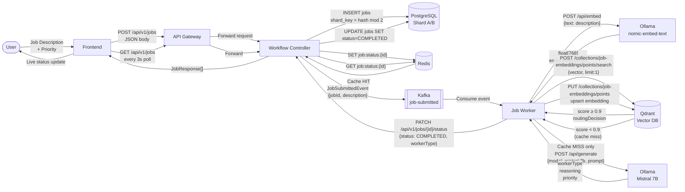

---

## 10. AI Routing Pipeline — Detailed Flow

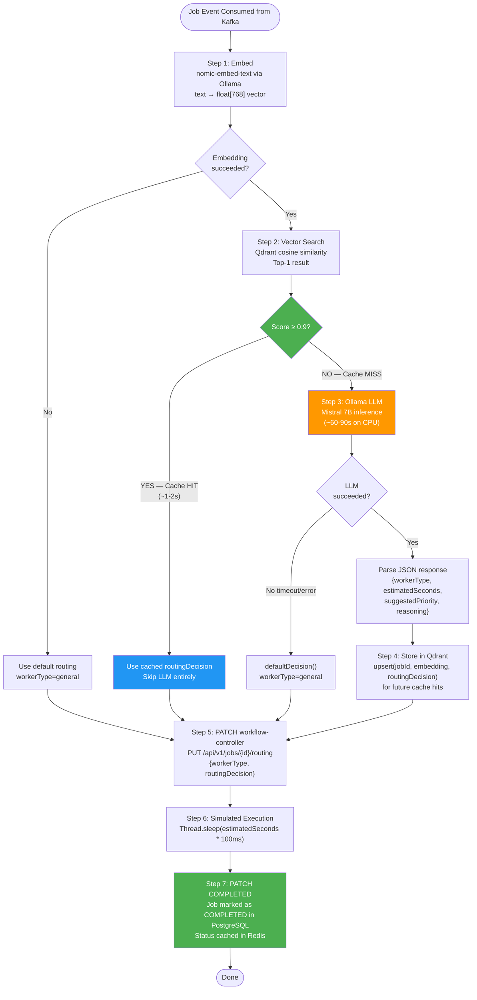

---

## 11. Sharding Logic Diagram

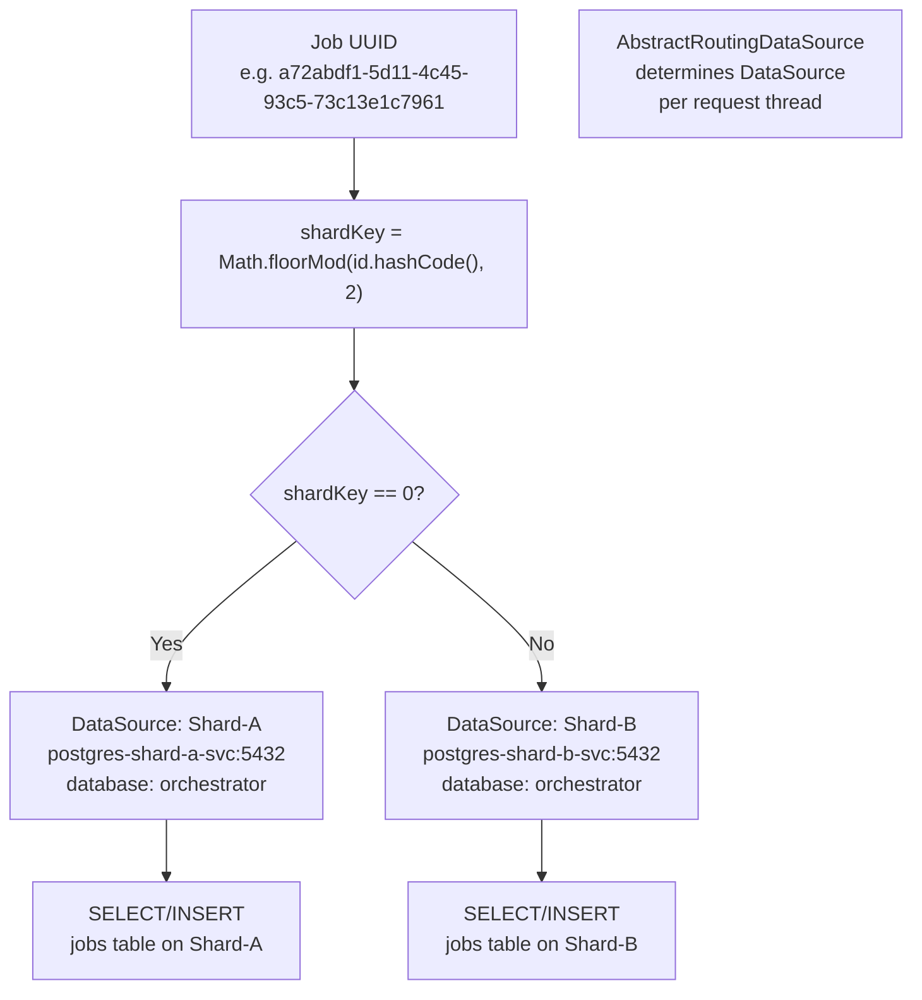
