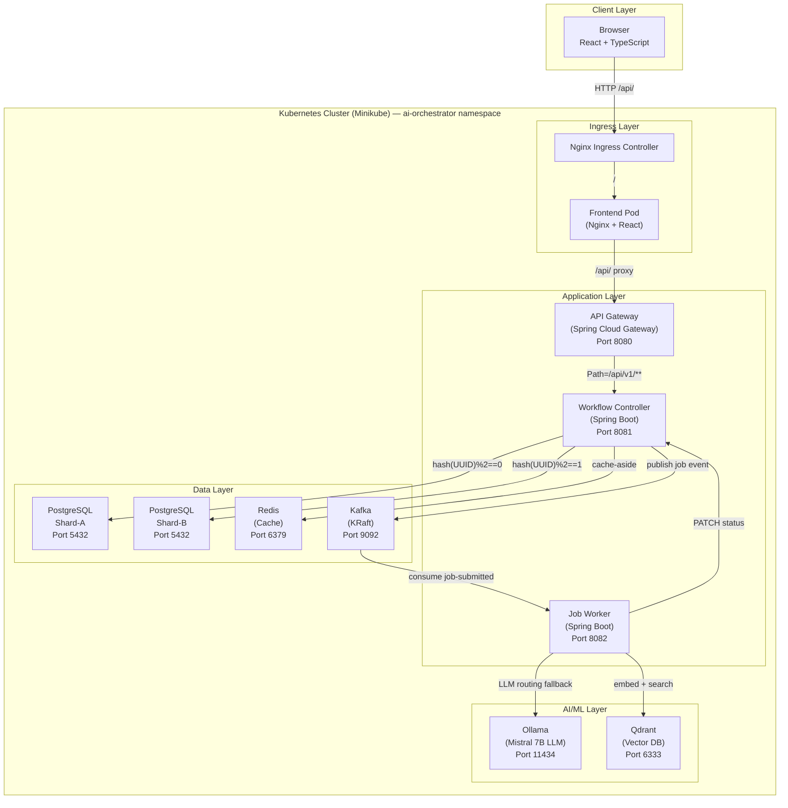

# System Architecture Diagram

```mermaid
graph TB
    subgraph Client["Client Layer"]
        Browser["Browser\nReact + TypeScript"]
    end

    subgraph K8s["Kubernetes Cluster (Minikube) — ai-orchestrator namespace"]
        subgraph Ingress["Ingress Layer"]
            NG["Nginx Ingress Controller"]
            FE["Frontend Pod\n(Nginx + React)"]
        end

        subgraph AppLayer["Application Layer"]
            GW["API Gateway\n(Spring Cloud Gateway)\nPort 8080"]
            WC["Workflow Controller\n(Spring Boot)\nPort 8081"]
            JW["Job Worker\n(Spring Boot)\nPort 8082"]
        end

        subgraph AILayer["AI/ML Layer"]
            OL["Ollama\n(Mistral 7B LLM)\nPort 11434"]
            QD["Qdrant\n(Vector DB)\nPort 6333"]
        end

        subgraph DataLayer["Data Layer"]
            PSA["PostgreSQL\nShard-A\nPort 5432"]
            PSB["PostgreSQL\nShard-B\nPort 5432"]
            RD["Redis\n(Cache)\nPort 6379"]
            KF["Kafka\n(KRaft)\nPort 9092"]
        end
    end

    Browser -->|"HTTP /api/"| NG
    NG -->|"/"| FE
    FE -->|"/api/ proxy"| GW
    GW -->|"Path=/api/v1/**"| WC
    WC -->|"hash(UUID)%2==0"| PSA
    WC -->|"hash(UUID)%2==1"| PSB
    WC -->|"cache-aside"| RD
    WC -->|"publish job event"| KF
    KF -->|"consume job-submitted"| JW
    JW -->|"embed + search"| QD
    JW -->|"LLM routing fallback"| OL
    JW -->|"PATCH status"| WC
```
