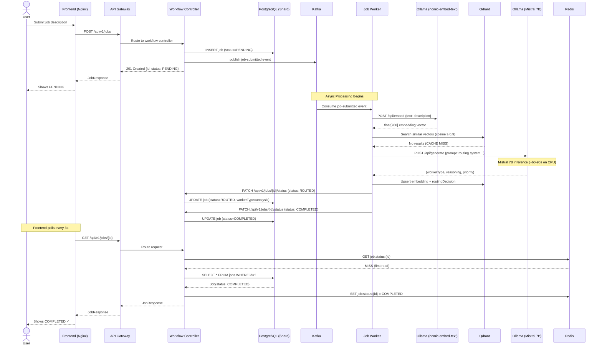

# Sequence Diagram — Job Submission (Cache MISS / LLM Path)

```mermaid
sequenceDiagram
    actor User
    participant FE as Frontend (Nginx)
    participant GW as API Gateway
    participant WC as Workflow Controller
    participant PG as PostgreSQL (Shard)
    participant KF as Kafka
    participant JW as Job Worker
    participant EM as Ollama (nomic-embed-text)
    participant QD as Qdrant
    participant LLM as Ollama (Mistral 7B)
    participant RD as Redis

    User->>FE: Submit job description
    FE->>GW: POST /api/v1/jobs
    GW->>WC: Route to workflow-controller
    WC->>PG: INSERT job (status=PENDING)
    WC->>KF: publish job-submitted event
    WC-->>GW: 201 Created {id, status: PENDING}
    GW-->>FE: JobResponse
    FE-->>User: Shows PENDING

    Note over KF,JW: Async Processing Begins

    KF->>JW: Consume job-submitted event
    JW->>EM: POST /api/embed {text: description}
    EM-->>JW: float[768] embedding vector

    JW->>QD: Search similar vectors (cosine ≥ 0.9)
    QD-->>JW: No results (CACHE MISS)

    JW->>LLM: POST /api/generate {prompt: routing system...}
    Note over LLM: Mistral 7B inference (~60-90s on CPU)
    LLM-->>JW: {workerType, reasoning, priority}

    JW->>QD: Upsert embedding + routingDecision
    JW->>WC: PATCH /api/v1/jobs/{id}/status {status: ROUTED}
    WC->>PG: UPDATE job (status=ROUTED, workerType=analysis)
    JW->>WC: PATCH /api/v1/jobs/{id}/status {status: COMPLETED}
    WC->>PG: UPDATE job (status=COMPLETED)

    Note over FE,User: Frontend polls every 3s

    FE->>GW: GET /api/v1/jobs/{id}
    GW->>WC: Route request
    WC->>RD: GET job:status:{id}
    RD-->>WC: MISS (first read)
    WC->>PG: SELECT * FROM jobs WHERE id=?
    PG-->>WC: Job{status: COMPLETED}
    WC->>RD: SET job:status:{id} = COMPLETED
    WC-->>GW: JobResponse
    GW-->>FE: JobResponse
    FE-->>User: Shows COMPLETED ✓
```
