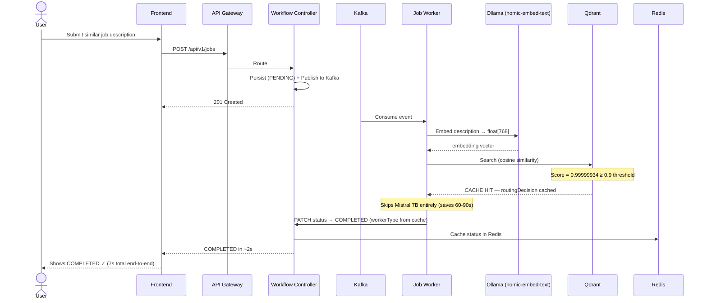

# Sequence Diagram — Job Submission (Qdrant Cache HIT — Fast Path)

```mermaid
sequenceDiagram
    actor User
    participant FE as Frontend
    participant GW as API Gateway
    participant WC as Workflow Controller
    participant KF as Kafka
    participant JW as Job Worker
    participant EM as Ollama (nomic-embed-text)
    participant QD as Qdrant
    participant RD as Redis

    User->>FE: Submit similar job description
    FE->>GW: POST /api/v1/jobs
    GW->>WC: Route
    WC->>WC: Persist (PENDING) + Publish to Kafka
    WC-->>FE: 201 Created

    KF->>JW: Consume event
    JW->>EM: Embed description → float[768]
    EM-->>JW: embedding vector

    JW->>QD: Search (cosine similarity)
    Note over QD: Score = 0.99999934 ≥ 0.9 threshold
    QD-->>JW: CACHE HIT — routingDecision cached

    Note over JW: Skips Mistral 7B entirely (saves 60-90s)

    JW->>WC: PATCH status → COMPLETED (workerType from cache)
    WC->>RD: Cache status in Redis
    WC-->>FE: COMPLETED in ~2s
    FE-->>User: Shows COMPLETED ✓ (7s total end-to-end)
```
