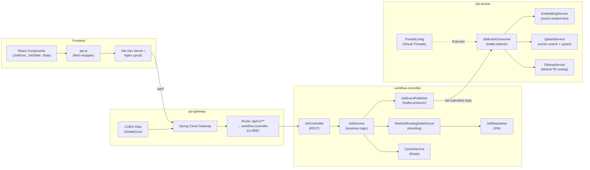

# Component Diagram

```mermaid
graph LR
    subgraph Frontend
        RC["React Components\n(JobForm, JobTable, Stats)"]
        API["api.ts\n(fetch wrapper)"]
        VT["Vite Dev Server /\nNginx (prod)"]
    end

    subgraph APIGateway["api-gateway"]
        SCG["Spring Cloud Gateway"]
        CORS["CORS Filter\n(GlobalCors)"]
        RT["Route: /api/v1/**\n→ workflow-controller-svc:8081"]
    end

    subgraph WorkflowController["workflow-controller"]
        JC["JobController\n(REST)"]
        JS["JobService\n(business logic)"]
        JP["JobEventPublisher\n(Kafka producer)"]
        ADS["AbstractRoutingDataSource\n(sharding)"]
        CS["CacheService\n(Redis)"]
        JR["JobRepository\n(JPA)"]
    end

    subgraph JobWorker["job-worker"]
        JEC["JobEventConsumer\n(Kafka listener)"]
        ES["EmbeddingService\n(nomic-embed-text)"]
        QDS["QdrantService\n(vector search + upsert)"]
        OLS["OllamaService\n(Mistral 7B routing)"]
        TC["ThreadConfig\n(Virtual Threads)"]
    end

    RC --> API
    API --> VT
    VT -->|"/api/*"| SCG
    CORS --> SCG
    SCG --> RT
    RT --> JC
    JC --> JS
    JS --> JP
    JS --> ADS
    JS --> CS
    ADS --> JR
    JP -->|"job-submitted topic"| JEC
    JEC --> ES
    JEC --> QDS
    JEC --> OLS
    TC -.->|"Executor"| JEC
```
