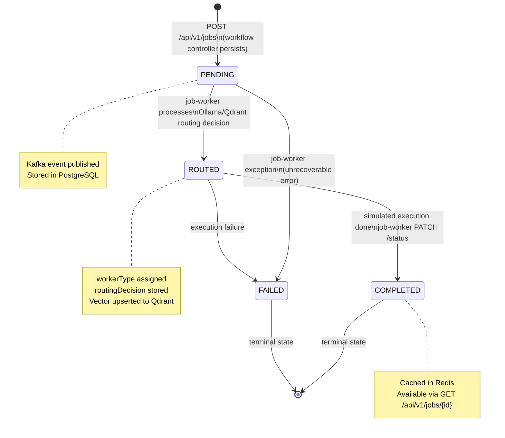

# State Machine — Job Lifecycle

```mermaid
stateDiagram-v2
    [*] --> PENDING: POST /api/v1/jobs\n(workflow-controller persists)

    PENDING --> ROUTED: job-worker processes\nOllama/Qdrant routing decision
    PENDING --> FAILED: job-worker exception\n(unrecoverable error)

    ROUTED --> COMPLETED: simulated execution done\njob-worker PATCH /status
    ROUTED --> FAILED: execution failure

    COMPLETED --> [*]: terminal state
    FAILED --> [*]: terminal state

    note right of PENDING
        Kafka event published
        Stored in PostgreSQL
    end note

    note right of ROUTED
        workerType assigned
        routingDecision stored
        Vector upserted to Qdrant
    end note

    note right of COMPLETED
        Cached in Redis
        Available via GET /api/v1/jobs/{id}
    end note
```
