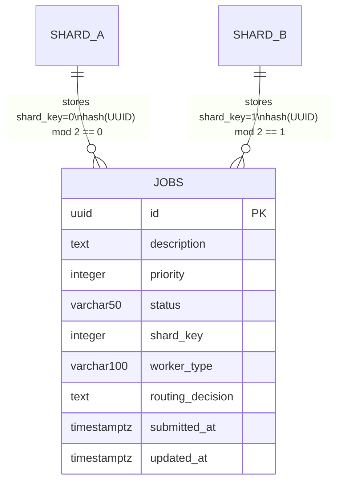

# Entity Relationship Diagram — PostgreSQL Schema

```mermaid
erDiagram
    JOBS {
        uuid id PK
        text description
        integer priority
        varchar50 status
        integer shard_key
        varchar100 worker_type
        text routing_decision
        timestamptz submitted_at
        timestamptz updated_at
    }

    SHARD_A ||--o{ JOBS : "stores shard_key=0\nhash(UUID) mod 2 == 0"
    SHARD_B ||--o{ JOBS : "stores shard_key=1\nhash(UUID) mod 2 == 1"
```
