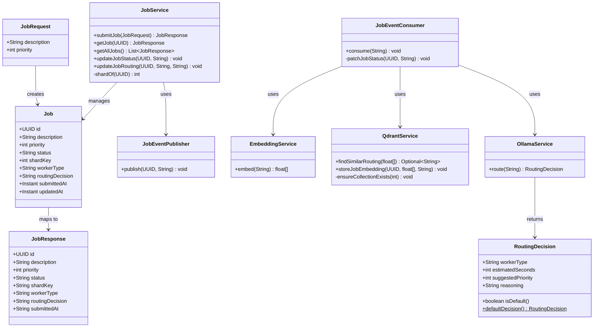

# Class Diagram — Domain Model

```mermaid
classDiagram
    class Job {
        +UUID id
        +String description
        +int priority
        +String status
        +int shardKey
        +String workerType
        +String routingDecision
        +Instant submittedAt
        +Instant updatedAt
    }

    class JobRequest {
        +String description
        +int priority
    }

    class JobResponse {
        +UUID id
        +String description
        +int priority
        +String status
        +String shardKey
        +String workerType
        +String routingDecision
        +String submittedAt
    }

    class JobService {
        +submitJob(JobRequest) JobResponse
        +getJob(UUID) JobResponse
        +getAllJobs() List~JobResponse~
        +updateJobStatus(UUID, String) void
        +updateJobRouting(UUID, String, String) void
        -shardOf(UUID) int
    }

    class JobEventPublisher {
        +publish(UUID, String) void
    }

    class JobEventConsumer {
        +consume(String) void
        -patchJobStatus(UUID, String) void
    }

    class EmbeddingService {
        +embed(String) float[]
    }

    class QdrantService {
        +findSimilarRouting(float[]) Optional~String~
        +storeJobEmbedding(UUID, float[], String) void
        -ensureCollectionExists(int) void
    }

    class OllamaService {
        +route(String) RoutingDecision
    }

    class RoutingDecision {
        +String workerType
        +int estimatedSeconds
        +int suggestedPriority
        +String reasoning
        +boolean isDefault()
        +defaultDecision()$ RoutingDecision
    }

    JobRequest --> Job : creates
    Job --> JobResponse : maps to
    JobService --> Job : manages
    JobService --> JobEventPublisher : uses
    JobEventConsumer --> EmbeddingService : uses
    JobEventConsumer --> QdrantService : uses
    JobEventConsumer --> OllamaService : uses
    OllamaService --> RoutingDecision : returns
```
