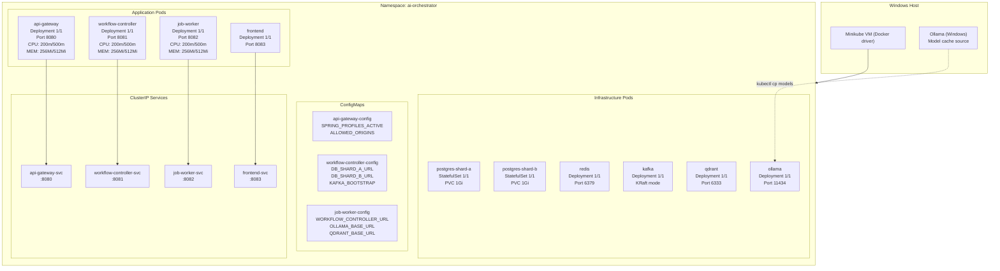

# Deployment Diagram — Kubernetes (Minikube)

```mermaid
graph TB
    subgraph Host["Windows Host"]
        MK["Minikube VM (Docker driver)"]
        OW["Ollama (Windows)\nModel cache source"]
    end

    subgraph NS["Namespace: ai-orchestrator"]
        subgraph AppPods["Application Pods"]
            GWP["api-gateway\nDeployment 1/1\nPort 8080\nCPU: 200m/500m\nMEM: 256Mi/512Mi"]
            WCP["workflow-controller\nDeployment 1/1\nPort 8081\nCPU: 200m/500m\nMEM: 256Mi/512Mi"]
            JWP["job-worker\nDeployment 1/1\nPort 8082\nCPU: 200m/500m\nMEM: 256Mi/512Mi"]
            FEP["frontend\nDeployment 1/1\nPort 8083"]
        end

        subgraph InfraPods["Infrastructure Pods"]
            PSA["postgres-shard-a\nStatefulSet 1/1\nPVC 1Gi"]
            PSB["postgres-shard-b\nStatefulSet 1/1\nPVC 1Gi"]
            RDP["redis\nDeployment 1/1\nPort 6379"]
            KFP["kafka\nDeployment 1/1\nKRaft mode"]
            QDP["qdrant\nDeployment 1/1\nPort 6333"]
            OLP["ollama\nDeployment 1/1\nPort 11434"]
        end

        subgraph Services["ClusterIP Services"]
            GWSVC["api-gateway-svc\n:8080"]
            WCSVC["workflow-controller-svc\n:8081"]
            JWSVC["job-worker-svc\n:8082"]
            FESVC["frontend-svc\n:8083"]
        end

        subgraph ConfigMaps["ConfigMaps"]
            GWCM["api-gateway-config\nSPRING_PROFILES_ACTIVE\nALLOWED_ORIGINS"]
            WCCM["workflow-controller-config\nDB_SHARD_A_URL\nDB_SHARD_B_URL\nKAFKA_BOOTSTRAP"]
            JWCM["job-worker-config\nWORKFLOW_CONTROLLER_URL\nOLLAMA_BASE_URL\nQDRANT_BASE_URL"]
        end
    end

    OW -.->|"kubectl cp models"| OLP
    MK --> NS
    GWP --> GWSVC
    WCP --> WCSVC
    JWP --> JWSVC
    FEP --> FESVC
```
