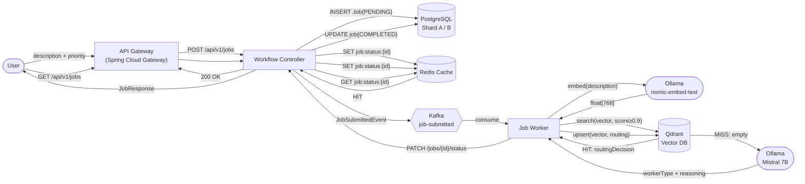

# Data Flow Diagram

```mermaid
flowchart LR
    User(["User"]) -->|"description + priority"| GW

    GW["API Gateway\n(Spring Cloud Gateway)"]
    GW -->|"POST /api/v1/jobs"| WC

    WC["Workflow Controller"]
    WC -->|"INSERT Job{PENDING}"| PG[("PostgreSQL\nShard A / B")]
    WC -->|"SET job:status:{id}"| RD[("Redis Cache")]
    WC -->|"JobSubmittedEvent"| KF{{"Kafka\njob-submitted"}}
    WC -->|"200 OK"| GW

    KF -->|"consume"| JW["Job Worker"]
    JW -->|"embed(description)"| EM(["Ollama\nnomic-embed-text"])
    EM -->|"float[768]"| JW
    JW -->|"search(vector, score≥0.9)"| QD[("Qdrant\nVector DB")]

    QD -->|"HIT: routingDecision"| JW
    QD -->|"MISS: empty"| LLM(["Ollama\nMistral 7B"])
    LLM -->|"workerType + reasoning"| JW

    JW -->|"upsert(vector, routing)"| QD
    JW -->|"PATCH /jobs/{id}/status"| WC
    WC -->|"UPDATE job{COMPLETED}"| PG
    WC -->|"SET job:status:{id}"| RD

    User -->|"GET /api/v1/jobs"| GW
    GW --> WC
    WC -->|"GET job:status:{id}"| RD
    RD -->|"HIT"| WC
    WC -->|"JobResponse"| User
```
