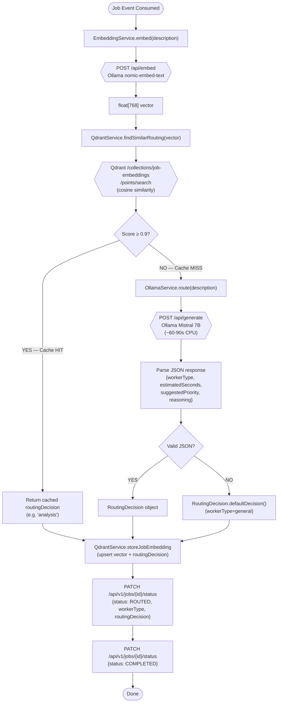

# AI Routing Pipeline — Detailed Flow

```mermaid
flowchart TD
    A([Job Event Consumed]) --> B["EmbeddingService.embed(description)"]
    B --> C{{"POST /api/embed\nOllama nomic-embed-text"}}
    C --> D["float[768] vector"]

    D --> E["QdrantService.findSimilarRouting(vector)"]
    E --> F{{"Qdrant /collections/job-embeddings\n/points/search\n(cosine similarity)"}}
    F --> G{Score ≥ 0.9?}

    G -->|YES — Cache HIT| H["Return cached routingDecision\n(e.g. 'analysis')"]
    G -->|NO — Cache MISS| I["OllamaService.route(description)"]

    I --> J{{"POST /api/generate\nOllama Mistral 7B\n(~60-90s CPU)"}}
    J --> K["Parse JSON response\n{workerType, estimatedSeconds,\nsuggestedPriority, reasoning}"]

    K --> L{Valid JSON?}
    L -->|YES| M["RoutingDecision object"]
    L -->|NO| N["RoutingDecision.defaultDecision()\n(workerType=general)"]

    H --> O["QdrantService.storeJobEmbedding\n(upsert vector + routingDecision)"]
    M --> O
    N --> O

    O --> P["PATCH /api/v1/jobs/{id}/status\n{status: ROUTED, workerType, routingDecision}"]
    P --> Q["PATCH /api/v1/jobs/{id}/status\n{status: COMPLETED}"]
    Q --> R([Done])
```
