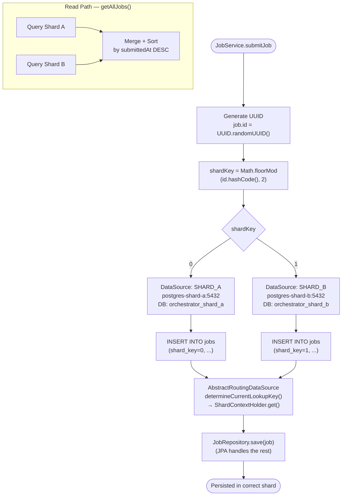

# Sharding Logic Diagram

```mermaid
flowchart TD
    A([JobService.submitJob]) --> B["Generate UUID\njob.id = UUID.randomUUID()"]
    B --> C["shardKey = Math.floorMod\n(id.hashCode(), 2)"]

    C --> D{shardKey}
    D -->|0| E["DataSource: SHARD_A\npostgres-shard-a:5432\nDB: orchestrator_shard_a"]
    D -->|1| F["DataSource: SHARD_B\npostgres-shard-b:5432\nDB: orchestrator_shard_b"]

    E --> G["INSERT INTO jobs\n(shard_key=0, ...)"]
    F --> H["INSERT INTO jobs\n(shard_key=1, ...)"]

    G --> I["AbstractRoutingDataSource\ndetermineCurrentLookupKey()\n→ ShardContextHolder.get()"]
    H --> I

    I --> J["JobRepository.save(job)\n(JPA handles the rest)"]
    J --> K([Persisted in correct shard])

    subgraph Read["Read Path — getAllJobs()"]
        R1["Query Shard A"] --> R3["Merge + Sort\nby submittedAt DESC"]
        R2["Query Shard B"] --> R3
    end
```
