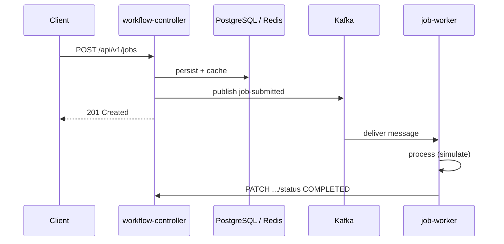

# Phase 2: Kafka in the orchestrator

## Producer and consumer roles

**Kafka producer** — A producer is a client that publishes **messages** (records) to a **named topic**. Topics are append-only logs; producers choose a topic (and optionally a key for partitioning). In this project, `workflow-controller` acts as the producer when a job is submitted: it sends a JSON event to the `job-submitted` topic without waiting for downstream processing.

**Kafka consumer** — A consumer **subscribes** to one or more topics (here, `job-submitted`), reads batches of records, and runs application logic on each payload. Our `job-worker` service listens for those events and drives the asynchronous part of job handling (simulate work, then tell the controller the job finished).

## Why Kafka decouples HTTP from execution

Submitting a job over HTTP (`POST /api/v1/jobs`) should respond quickly once the submission is persisted and acknowledged. Putting a **Kafka** event in between means the controller writes to PostgreSQL and Redis, publishes to Kafka in a **fire-and-forget** way (logging failures without failing the HTTP response), and returns. Actual processing happens later in `job-worker`, which may scale or restart independently.

## End-to-end flow

1. **Client** sends `POST /api/v1/jobs` with description and priority.
2. **`workflow-controller`** saves the row in PostgreSQL (with shard routing), updates Redis status cache-aside, and **publishes** a JSON event to **`job-submitted`** keyed by job id.
3. **`job-worker`** (consumer group `job-worker-group`) consumes the message, parses `jobId`, simulates processing, then **`PATCH`**es `http://workflow-controller-svc:8081/api/v1/jobs/{jobId}/status` with `{"status":"COMPLETED"}`.
4. The controller updates DB and Redis so clients see **COMPLETED** on subsequent reads.

## When `job-worker` is down

If the worker is unavailable, Kafka **retains messages** according to broker/topic retention. Consumers in group `job-worker-group` advance **offsets** after successful commits; messages not yet acknowledged stay available so when **job-worker** comes back, consumption resumes from the last committed offset (with `auto-offset-reset: earliest` applying when there is **no committed offset**, e.g. a new consumer group).

## Why the consumer group id matters

Consumers that share the same **`group.id`** form one **consumer group**. For each partition of the topic, **only one consumer instance in that group** is assigned the partition—so **each message is delivered to one worker** in the group (load balancing), not duplicated across instances. Adding more workers increases parallelism up to the number of partitions; a different group id would be an independent subscriber (useful for separate read pipelines, but not desired for duplicated processing of the same job events).
